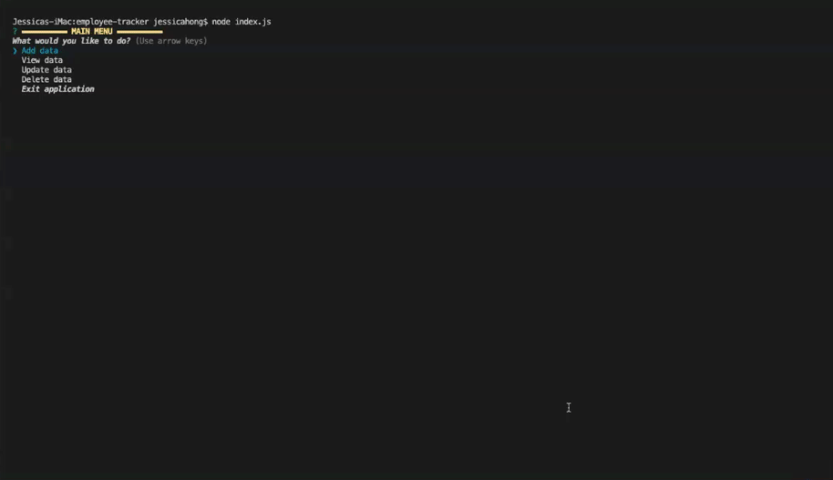

# Employee Tracker

## Description 

*Employee Tracker* is a command-line content management system (CMS) application that allows users to add, view, update and delete data relating to employees, roles and departments. 

## Table of Contents

- [Installation](#Installation)
- [Video Walkthrough](#Video-Walkthrough)
- [Technologies Used](#Technologies-Used)
- [Application User Interface](#Application-User-Interface)
- [Questions](#Questions)

## Installation

1. Clone this repository onto your local computer
2. Using the MySQL server, run the 'schema.sql' file to create the application database
3. (Optional) For testing purposes, run the 'seed.sql' file to pre-populate the database
4. In the command line, navigate to the cloned repository (the 'employee-tracker' directory)
5. Install the required dependencies by running the command: **npm install** 

## Video Walkthrough

[Click here](https://drive.google.com/file/d/1l169Oli96u7uk08FU8Lc9omK-agXakGg/view?usp=sharing) to view a video walkthrough of the application functionality.

## Technologies Used

- SQL 
- MySQL Workbench
- MySQL Community Server
- JavaScript 
- Node.js
- npm mysql package
- npm inquirer package
- npm console.table package
- npm chalk package

## Application User Interface

## Questions

**My GitHub Profile:** [jkaho](https://github.com/jkaho)

If you have any further questions, please feel free to email me at [j.h_7@yahoo.com](mailto:j.h_7@yahoo.com)
